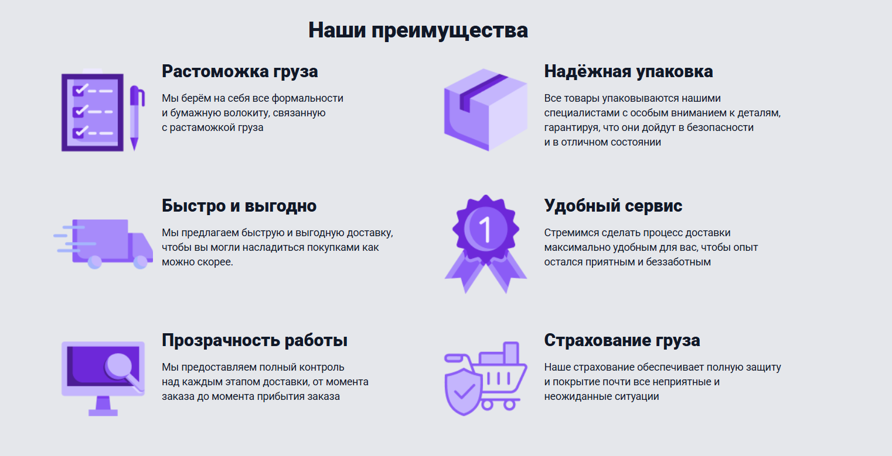

# 📦 FromBoard Delivery

Сайт компании по доставке товаров из США, Европы и Азии в Россию. Разработан на WordPress с использованием кастомной темы, Elementor и собственных виджетов. Формы реализованы через Contact Form 7.

---

## 📸 Превью

### Главная секция:

### Преимущества:

### Отзывы:

---

## 🚀 Основные технологии

- **WordPress** — CMS
- **Кастомная тема** — с нуля написанная тема
- **Elementor** — для сборки страниц
- **Кастомные Elementor-виджеты** — реализованы блоки:
  - Главный экран
  - Преимущества
  - Качество
  - Вопросы
  - Отзывы
- **Redux Framework** — для управления настройками темы
- **Contact Form 7** — форма заявки

---

## ⚙️ Установка

1. Залей содержимое `themes/delivery/` в `wp-content/themes/delivery`
2. Активируй тему в админке WordPress
3. Установи и активируй:
   - [Elementor](https://wordpress.org/plugins/elementor/)
   - [Contact Form 7](https://wordpress.org/plugins/contact-form-7/)
   - [Redux Framework](https://wordpress.org/plugins/redux-framework/) (если не встроен)
4. Добавь страницу и собери её с помощью Elementor и кастомных виджетов

---

## 📬 Форма обратной связи

Реализована через **Contact Form 7**. Кнопка "Оставить заявку" открывает форму отправки с возможностью связаться с менеджером компании.

---

## 🔗 Контакты и авторство

Разработано для портфолио.
---

